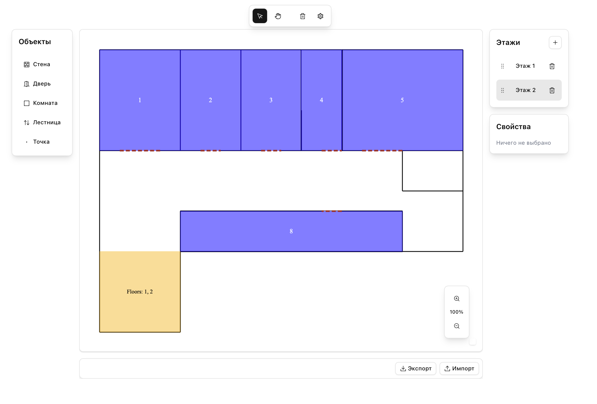

<div align="center">
  <h1>locate it</h1>
  <p>
    ✨ Современное приложение на Next.js с использованием алгоритмов поиска пути.  
  </p>

  <p>
    <a href="https://nextjs.org">
      
    </a>
    <a href="https://react.dev">
      
    </a>
    <a href="https://www.typescriptlang.org/">
      
    </a>
    <a href="https://zustand-demo.pmnd.rs/">
      
    </a>
    <a href="https://tailwindcss.com/">
      
    </a>
    <a href="https://github.com/fabricjs/fabric.js/">
      
    </a>
    
    
    
  </p>
  
  
</div>

---

## ✨ Возможности

- Интерактивный конструктор помещений, стен, лестниц и дверей
- Мгновенная визуализация алгоритмов поиска пути (A*, Dijkstra)
- Редактирование и сохранение этажей

---

## 🚀 Быстрый старт

```bash
pnpm install
pnpm dev
